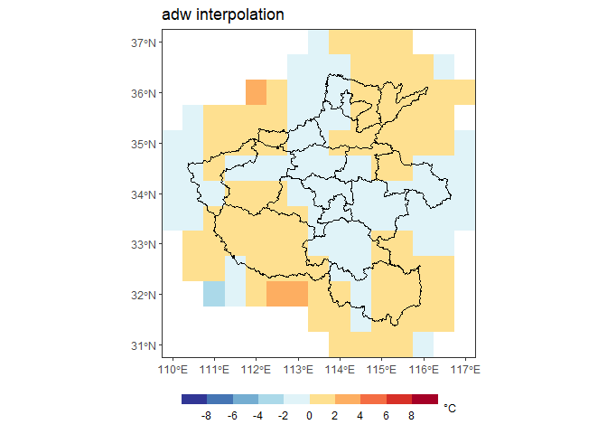

# Angular distance weighting (adw)

The irregularly-spaced data are interpolated onto a regular
latitude-longitude grid by weighting each station according to its
distance and angle from the center of a search radius

# Reference

Caesar, J., L. Alexander, and R. Vose, 2006: Large-scale changes in
observed daily maximum and minimum temperatures: Creation and analysis
of a new gridded data set. J. Geophys. Res., 111, D05101.

# Installation

The **development** version can be installed from GitHub
(<https://github.com/PanfengZhang/adw>) using:

    # install.packages("remotes")
    remotes::install_github("PanfengZhang/adw")

# Usage

    library(adw)
    library(ggplot2)
    library(sf)

    ## Linking to GEOS 3.9.1, GDAL 3.2.1, PROJ 7.2.1; sf_use_s2() is TRUE

    set.seed(2)
    dd <- data.frame(lon = runif(100, min = 110, max = 117),
                     lat = runif(100, min = 31, max = 37),
                     value = runif(100, min = -10, max = 10))
    head(dd)

    ##        lon      lat     value
    ## 1 111.2942 32.20561  7.173832
    ## 2 114.9166 33.56583  2.903207
    ## 3 114.0133 36.88360  2.055973
    ## 4 111.1764 35.97353  9.439614
    ## 5 116.6069 32.72184 -2.466855
    ## 6 116.6043 34.57550  6.382290

    dg <- adw(dd, gridSize = 0.5, cdd = 1e5, m = 4) %>% na.omit()
    head(dg)

    ##        lon      lat      value
    ## 2 110.0498 31.58175  0.9184081
    ## 3 110.0498 32.08175  2.6968468
    ## 4 110.0498 32.58175  2.7460656
    ## 5 110.0498 33.08175 -5.8251044
    ## 6 110.0498 33.58175 -5.9952006
    ## 7 110.0498 34.08175 -0.9095270

    urlmap <- "https://geo.datav.aliyun.com/areas_v3/bound/410000_full.json"
    cmap <- read_sf(urlmap) %>% st_cast('MULTILINESTRING')
    library(ggplot2)
    ggplot() +
      geom_tile(data = dg, aes(x = lon, y = lat, fill = value)) +
      geom_sf(data = cmap) +
      coord_sf(expand = FALSE) +
      guides(fill = guide_coloursteps(title.position = "right")) +
      ggtitle("adw interpolation") +
      scale_fill_fermenter(palette = "RdYlBu", na.value = "white", 
                           breaks = seq(-8, 8, 2),
                           limits = c(-11, 11),
                           name = expression("\u00B0C")) +
      theme_bw() +
      theme(legend.position = "bottom",
            legend.key.width = unit(1.5, "cm"),
            legend.key.height = unit(0.3, "cm"),
            axis.title = element_blank(),
            legend.title = element_text(face = "plain", size = 9))

