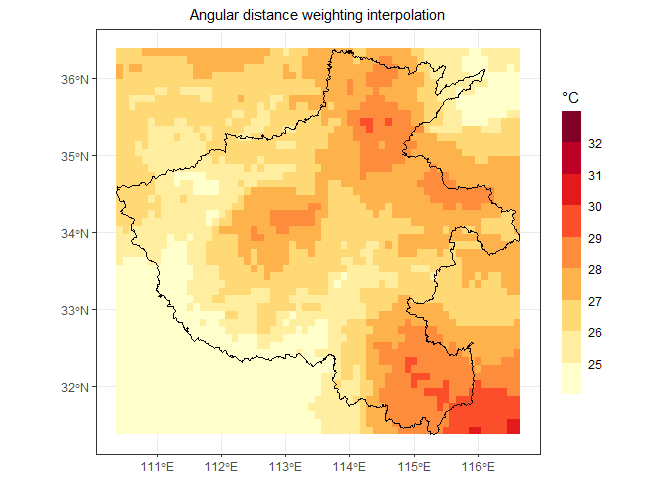

## Angular Distance Weighting Interpolation

The irregularly-spaced data are interpolated onto regular latitude-longitude grids by weighting each station according to its distance and angle from the center of a search radius.

In addition to this, we also provide a simple way (Jones and Hulme, 1996) to grid the irregularly-spaced data points onto regular latitude-longitude grids by averaging all stations in grid-boxes.

## Reference

Caesar, J., L. Alexander, and R. Vose, 2006: Large-scale changes in observed daily maximum and minimum temperatures: Creation and analysis of a new gridded data set. Journal of Geophysical Research, 111, <https://doi.org/10.1029/2005JD006280>.

Jones, P. D., and M. Hulme, 1996: Calculating regional climatic time series for temperature and precipitation: Methods and illustrations. Int. J. Climatol., 16, 361–377, <https://doi.org/10.1002/(SICI)1097-0088(199604)16:4&lt;361::AID-JOC53&gt;3.0.CO;2-F>.


## Installation

Install the latest CRAN release via command:

```r
install.packages("adw")
```

## generate data and plot scatter


```r
library(sf)
library(ggplot2)
library(adw)
library(cnmap)

set.seed(1)
tavg <- data.frame(lon = runif(100, min = 110, max = 117),
                   lat = runif(100, min = 31, max = 37),
                   value = runif(100, min = 20, max = 35))

hmap <- getMap(name = "河南省", returnClass = "sf")
ggplot() +
  geom_point(data = tavg, aes(x = lon, y = lat, colour = value), 
             pch = 17, size = 2.5) +
  geom_sf(data = st_cast(hmap, 'MULTILINESTRING')) +
  scale_colour_fermenter(palette = "YlOrRd",
                         direction = 1,
                         breaks = seq(from = 25, to = 32, by = 1),
                         limits = c(0, 100),
                         name = expression("\u00B0C")) +
  ggtitle("The irregularly-spaced data") +
  theme_bw() +
  theme(axis.title = element_blank(),
        legend.key.width = unit(0.5,"cm"),
        legend.key.height = unit(1.5, "cm"),
        plot.title = element_text(hjust = 0.5, size = 11))
```

<!-- -->

## Interpolation
### Usage 1

The parameter *extent* in the **adw** function is a *sf* class (sf package), and the coordinate reference system of the object is WGS1984 (EPSG: 4326).


```r
library(adw)
hmap_sf <- getMap(name = "河南省", returnClass = "sf") |> st_make_valid()
dg <- adw(tavg, extent = hmap_sf, gridsize = 0.1, cdd = 400)
head(dg)
#>          lon      lat    value
#> 50  115.3105 31.43345 28.89078
#> 107 114.7105 31.53345 28.40398
#> 108 114.8105 31.53345 28.45766
#> 109 114.9105 31.53345 28.64374
#> 110 115.0105 31.53345 28.71852
#> 113 115.3105 31.53345 28.92356
ggplot() +
  geom_tile(data = dg, aes(x = lon, y = lat, fill = value)) +
  geom_sf(data = st_cast(hmap_sf, 'MULTILINESTRING')) +
  scale_fill_fermenter(palette = "YlOrRd",
                       direction = 1,
                       breaks = seq(from = 25, to = 32, by = 1),
                       limits = c(0, 100),
                       name = expression("\u00B0C"),
                       na.value = "white") +
  ggtitle("Angular distance weighting interpolation") +
  theme_bw() +
  theme(axis.title = element_blank(),
        legend.key.width = unit(0.5,"cm"),
        legend.key.height = unit(1.5, "cm"),
        plot.title = element_text(hjust = 0.5, size = 11))
```

<!-- -->

### Usage 2

The parameter *extent* in the **adw** function is a *SpatVector* class (terra packag), and the coordinate reference system of the object is WGS1984 (EPSG: 4326).


```r
library(adw)
library(terra)
#> terra 1.7.71
hmap_sv <- getMap(name = "河南省", returnClass = "sv")
dg <- adw(tavg, extent = hmap_sv, gridsize = 0.1, cdd = 400)
head(dg)
#>        lon      lat    value
#> 1 115.3105 31.43345 28.89078
#> 2 114.7105 31.53345 28.40398
#> 3 114.8105 31.53345 28.45766
#> 4 114.9105 31.53345 28.64374
#> 5 115.0105 31.53345 28.71852
#> 6 115.3105 31.53345 28.92356
ggplot() +
  geom_tile(data = dg, aes(x = lon, y = lat, fill = value)) +
  geom_sf(data = st_cast(hmap_sf, 'MULTILINESTRING')) +
  scale_fill_fermenter(palette = "YlOrRd",
                       direction = 1,
                       breaks = seq(from = 25, to = 32, by = 1),
                       limits = c(0, 100),
                       name = expression("\u00B0C"),
                       na.value = "white") +
  ggtitle("Angular distance weighting interpolation") +
  theme_bw() +
  theme(axis.title = element_blank(),
        legend.key.width = unit(0.5,"cm"),
        legend.key.height = unit(1.5, "cm"),
        plot.title = element_text(hjust = 0.5, size = 11))
```

<!-- -->

### Usage 3

The parameter *extent* in the **adw** function is a extent *vector* of length 4 in the order [xmin, xmax, ymin, ymax]


```r
library(adw)
interpExtent <- c(110.36, 116.65, 31.38, 36.37) # [xmin, xmax, ymin, ymax]
dg <- adw(tavg, extent = interpExtent, gridsize = 0.1, cdd = 400)
head(dg)
#>      lon   lat    value
#> 1 110.41 31.43 24.57478
#> 2 110.51 31.43 24.44855
#> 3 110.61 31.43 24.41044
#> 4 110.71 31.43 24.36908
#> 5 110.81 31.43 24.32720
#> 6 110.91 31.43 24.28706
ggplot() +
  geom_tile(data = dg, aes(x = lon, y = lat, fill = value)) +
  geom_sf(data = st_cast(hmap_sf, 'MULTILINESTRING')) +
  scale_fill_fermenter(palette = "YlOrRd",
                       direction = 1,
                       breaks = seq(from = 25, to = 32, by = 1),
                       limits = c(0, 100),
                       name = expression("\u00B0C"),
                       na.value = "white") +
  ggtitle("Angular distance weighting interpolation") +
  theme_bw() +
  theme(axis.title = element_blank(),
        legend.key.width = unit(0.5,"cm"),
        legend.key.height = unit(1.5, "cm"),
        plot.title = element_text(hjust = 0.5, size = 11))
```

<!-- -->


### Usage 4


The irregularly-spaced data of points are converted onto regular latitude-longitude grids by averaging all stations in grid-boxes. The parameter *extent* in the **points2grid** function is a extent *vector* of length 4 in the order [xmin, xmax, ymin, ymax], or a simple fearture object, or a SpatVect object.


```r
library(adw)
interpExtent <- c(110.36, 116.65, 31.38, 36.37) # [xmin, xmax, ymin, ymax]
dg <- points2grid(tavg, extent = interpExtent, gridsize = 0.5)
head(dg)
#>      lon   lat   value
#> 1 110.61 31.63     NaN
#> 2 111.11 31.63     NaN
#> 3 111.61 31.63     NaN
#> 4 112.11 31.63     NaN
#> 5 112.61 31.63     NaN
#> 6 113.11 31.63 21.2272
ggplot() +
  geom_tile(data = dg, aes(x = lon, y = lat, fill = value)) +
  geom_sf(data = st_cast(hmap_sf, 'MULTILINESTRING')) +
  scale_fill_fermenter(palette = "YlOrRd",
                       direction = 1,
                       breaks = seq(from = 25, to = 32, by = 1),
                       limits = c(0, 100),
                       name = expression("\u00B0C"),
                       na.value = "white") +
  ggtitle("Averaging all stations in grid-boxes") +
  theme_bw() +
  theme(axis.title = element_blank(),
        legend.key.width = unit(0.5,"cm"),
        legend.key.height = unit(1.5, "cm"),
        plot.title = element_text(hjust = 0.5, size = 11))
```

<!-- -->

### Area weight average

The large area, or hemispheric, or global averages can be calculated dependent on the area represented by the grid-point or grid-box. The weight of latitude-longitude grid-points-boxes should be the cosine of the latitude of the ith grid-point-box.


```r
dg <- na.omit(dg)
awa(dg$value, dg$lat)
#> [1] 26.21314
```
